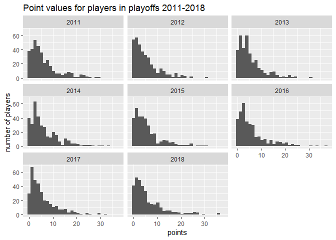
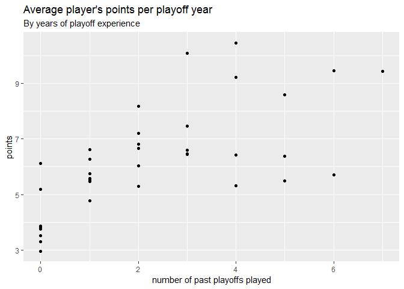
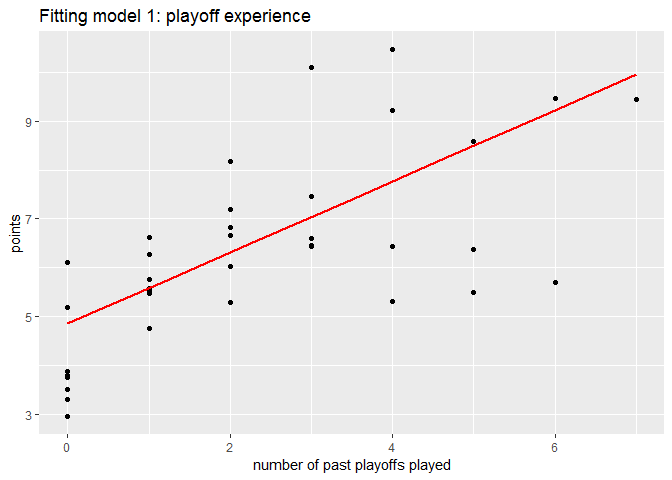
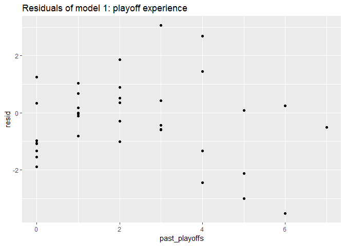
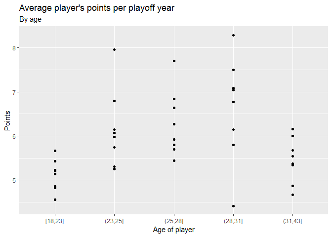
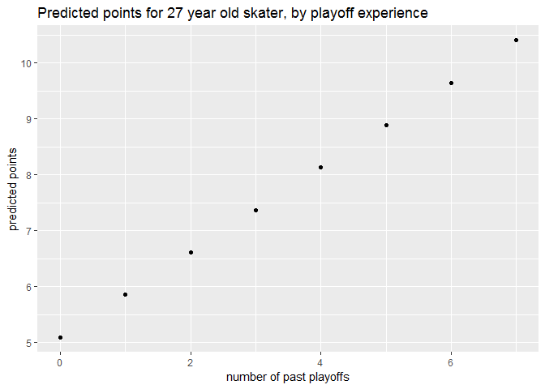
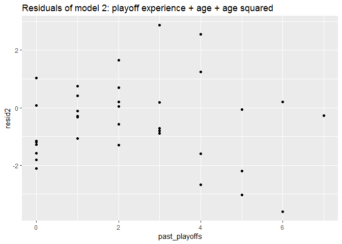

Answering the wrong question in hockey analytics really, really well
====================================================================

I joined a hockey playoff pool and thought I'd share my hasty-and-it-shows analysis to pick my roster. I don't know anything about hockey, but I wanted to do better this year than the last one. There might be something technique-wise that you can get out of reading this and I'll hopefully learn where I could have made better predictions.

The Brief
---------

Select a roster of 12 players who will score the highest on this formula in the 2019 NHL playoffs:

`Player’s points = goals + assists + game winning goals + blocked shots/10 + hits/15`

Here's a few tips as well from the fantasy hockey veterans in my pool:

-   have good players on the team that wins the cup
-   top lines play more than 3rd or 4th lines, especially if they don't play the power play
-   don't draft a goalie

Noted!

Not having any theories about what to look for I thought I'd look to the data for inspiration. We were sent a link to a hockey stats [website](https://www.hockey-reference.com/playoffs/) that looked pretty good. There's many years of data on the players themselves and that's where I can find the variables that end up directly in our pool's scoring equation.

Getting data
------------

I think most people would reach for python when looking to grab some data off the web, but the **rvest** package proved more than capable here. I'll just skate over the details of web scraping, but suffice to say this data was pretty clean to begin with - always a plus!

``` r
library(rvest)
library(modelr)
library(tidyverse)
library(here)

# I'll get eight years of data, arbitrarily
years <- 2011:2018

load_player_data <- function(yr) {
  
  print( paste0("Scraping ", yr) )
  html <- read_html(paste0("https://www.hockey-reference.com/playoffs/NHL_", yr, "_skaters.html"))
  
  # the table I want has the id 'stats' so I can pull it in swiftly
  stats <- html %>% 
    html_node('#stats') %>% 
    html_table() 
  
  # fix col names
  names(stats) <- unlist(stats[1,])
  
  # remove rows that just repeat the header
  result <- stats %>% 
    set_tidy_names() %>% 
    filter( Rk != "Rk" ) %>% 
    as_tibble() %>% 
    mutate( playoff_year = yr )
  
  # be nice to your host 
  Sys.sleep(2)
  
  result
  
}

# scrape if needed, but load previous data if I can
if (fs::file_exists(here("data/nhl_stats.rds"))) {
  nhl <- read_rds(here("data/nhl_stats.rds"))
} else {
  nhl <- map( years, load_player_data ) %>% 
    bind_rows()
  nhl %>% write_rds(here("data/nhl_stats.rds"))
}
```

That code nets us eight years of basic player stats (I made the column names nicer behind the scenes too). A quick count of players in a year is a good idea to check for any obvious omissions.

``` r
nhl %>% 
  count(playoff_year) 
```

    ## # A tibble: 8 x 2
    ##   playoff_year     n
    ##          <int> <int>
    ## 1         2011   339
    ## 2         2012   347
    ## 3         2013   351
    ## 4         2014   344
    ## 5         2015   339
    ## 6         2016   340
    ## 7         2017   343
    ## 8         2018   333

Looks good, no sudden spikes or drops.

Alright, we know this is a maximization problem: there's a formula and we want to give it the inputs that'll give us the highest output. Lets calculate the score each of these players got at the end of each playoffs according to our pool's formula.

A peek at the rest of this data begins my orientation.

``` r
str(nhl)
```

    ## Classes 'tbl_df', 'tbl' and 'data.frame':    2736 obs. of  28 variables:
    ##  $ rank                            : chr  "1" "2" "3" "4" ...
    ##  $ player                          : chr  "Justin Abdelkader" "Craig Adams" "Andrew Alberts" "Karl Alzner" ...
    ##  $ age                             : chr  "23" "33" "29" "22" ...
    ##  $ team                            : chr  "DET" "PIT" "VAN" "WSH" ...
    ##  $ pos                             : chr  "LW" "RW" "D" "D" ...
    ##  $ games_played                    : chr  "11" "7" "9" "9" ...
    ##  $ goals                           : chr  "0" "1" "0" "0" ...
    ##  $ assists                         : chr  "0" "0" "0" "1" ...
    ##  $ points                          : chr  "0" "1" "0" "1" ...
    ##  $ plus_minus                      : chr  "-4" "2" "-8" "-4" ...
    ##  $ penalties_in_minutes            : chr  "22" "2" "6" "0" ...
    ##  $ even_strength_goals             : chr  "0" "1" "0" "0" ...
    ##  $ power_play_goals                : chr  "0" "0" "0" "0" ...
    ##  $ short_handed_goals              : chr  "0" "0" "0" "0" ...
    ##  $ game_winning_goals              : chr  "0" "0" "0" "0" ...
    ##  $ even_strength_assists           : chr  "" "" "" "" ...
    ##  $ power_play_assists              : chr  "" "" "" "" ...
    ##  $ short_handed_assists            : chr  "" "" "" "" ...
    ##  $ shots_on_goal                   : chr  "17" "6" "6" "12" ...
    ##  $ shooting_percentage             : chr  "0.0" "16.7" "0.0" "0.0" ...
    ##  $ ice_time_minutes                : chr  "148" "92" "115" "205" ...
    ##  $ ice_time_avg                    : chr  "13:27" "13:07" "12:49" "22:45" ...
    ##  $ blocks_at_even_strength         : chr  "6" "9" "10" "20" ...
    ##  $ hits_at_even_strength           : chr  "28" "20" "26" "9" ...
    ##  $ faceoff_wins_at_even_strength   : chr  "43" "24" "0" "0" ...
    ##  $ faceoff_losses_at_even_strength : chr  "34" "22" "0" "0" ...
    ##  $ faceoff_win_pct_at_even_strength: chr  "55.8" "52.2" "" "" ...
    ##  $ playoff_year                    : int  2011 2011 2011 2011 2011 2011 2011 2011 2011 2011 ...

I can see the columns I need were brought in as a bunch of text values, but we need numeric values for calculations. I use the very handy `mutate_at` function to do this en masse and then do the calculation.

``` r
# change all col types to numeric except when we don't
# replace their missing values with 0's while we're at it
nhl <- nhl %>% 
  mutate_at(
    vars( everything(), -player, -team, -pos, -ice_time_avg ), 
    funs( . %>% as.numeric %>% replace_na(0) )
    ) 

nhl <- nhl %>% 
  mutate(
    pool_pts = goals + assists + game_winning_goals + blocks_at_even_strength / 10 + hits_at_even_strength / 15 
  )
```

Exploring the data
------------------

Now we can look at how much this score varies between playoffs - I was taught long ago that without varying values there's nothing to model. I'll plot it and see if different players get different scores.

``` r
nhl %>% 
  ggplot( aes(pool_pts) ) +
  geom_histogram() +
  facet_wrap(~playoff_year) +
  labs( title = "Point values for players in playoffs 2011-2018",
        x = "points",
        y = "number of players")
```



There's a nice spread of points each year and most players won't get more than 10 points. 30 points is exceptional. We want to find anything about a player that might be predictive of their score, but will also be something that we'll know about the player at the start of the 2019 playoffs.

Some players will have had more playoffs experience than others so that seems like a good place to start. I'll count how many playoffs each player was in starting from 2011 (where my data begins).

``` r
# add number of past playoffs each player's been in 
nhl <- nhl %>% 
  group_by( player ) %>% 
  mutate( past_playoffs = rank(playoff_year)-1 ) %>% 
  ungroup()

# plot the average points per playoff year
avg_points <- nhl %>% 
  group_by( playoff_year, past_playoffs ) %>% 
  summarise( pool_pts = mean(pool_pts),
             obs = n()) 
avg_points %>% 
  ggplot( aes( past_playoffs, pool_pts )) +
  geom_point() +
  labs(title = "Average player's points per playoff year",
       subtitle = "By years of playoff experience",
       x = "number of past playoffs played",
       y = "points")
```



Looking at the average points per playoffs across all players, experience in terms of previous playoffs looks linearly associated to points, with some substantial variability. This may be because players with seven years of playoffs from 2011 to 2018 are much rarer than rookie players overall.

We can try and regress points on past playoffs to see how well our predictions fit.

``` r
# fit model
mod_player <- lm( pool_pts ~ past_playoffs, data = nhl)
# generate predictions
grid <- nhl %>% 
  data_grid( past_playoffs = seq_range( past_playoffs, 7)) %>% 
  add_predictions(mod_player, "pool_pts")
# plot predictions on our mean calculations from before
avg_points %>% 
  ggplot( aes( past_playoffs, pool_pts)) +
  geom_point() +
  geom_line(data = grid, color = "red", size = 1) +
  labs(title = "Fitting model 1: playoff experience",
       x = "number of past playoffs played",
       y = "points")
```



The model's alright at lower value of experience, but gets worse into the higher ones. We can see if there's any pattern to our errors by checking the residuals of our model.

``` r
avg_points <- avg_points %>% 
  add_residuals(mod_player, "resid")

avg_points %>% 
  ggplot( aes(past_playoffs, resid) ) +
  geom_point() +
  labs(title = "Residuals of model 1: playoff experience")
```



It looks pretty randomly spread around 0 until five past playoffs or more where we see a consistent over estimation. I'll leave this be for now for time's sake as I'm curious about a related variable: is there any association between a player's age and points? I realize age is probably correlated with past playoff experience, but I'll ignore that here.

``` r
# bin age so it's easier to summarise it
qq <- quantile( nhl$age, seq_range(0:1, by = 0.2))
nhl <- nhl %>% 
  mutate( age_bin = cut( age, qq, include.lowest = T) ) 

points_by_age <- nhl %>%
  group_by( playoff_year, age_bin ) %>% 
  summarise(pool_pts = mean(pool_pts),
            obs = n())

points_by_age %>% 
  ggplot( aes(age_bin, pool_pts) ) +
  geom_point() +
  labs(title = "Average player's points per playoff year",
       subtitle = "By age",
        x = "Age of player",
        y = "Points")
```



There's a sort off peak in someone's career where their play is generating the most points. We could get at this with the curve of a quadratic equation so let's try adding that to the model.

``` r
mod_player2 <- lm( pool_pts ~ past_playoffs + age + I(age^2), data = nhl )

grid <- nhl %>% 
  data_grid( 
    past_playoffs,
    .model = mod_player2 ) %>% 
  add_predictions(mod_player2, "pool_pts") 

grid %>% 
  ggplot( aes( past_playoffs, pool_pts) ) +
  geom_point() +
  labs( title = "Predicted points for 27 year old skater, by playoff experience",
        x = "number of past playoffs",
        y = "predicted points")
```



This plot just uses the median value of our new predictor age for plotting: 27. We can get at more detail by looking at the residuals.

``` r
avg_age <- nhl %>% 
  group_by( playoff_year, past_playoffs ) %>% 
  summarise( age = mean(age) ) 

avg_points %>% 
  left_join(avg_age) %>% 
  add_residuals( mod_player2, "resid2") %>% 
  ggplot(aes( past_playoffs, resid2 )) +
  geom_point() +
  labs(title = "Residuals of model 2: playoff experience + age + age squared")
```



Nothing's changed from our previous plot really. We still have trouble predicting points for the more experienced players, controlling for age.

Unfortunately, I'd used up all my time before I got to try looking at line shifts like we were encourage to. Next time! I'll move on to making predictions using the model I have.

Making predictions
------------------

To make predictions, we'll need a roster of this year's players that has at the minimum their age and name (so we can look them up and see if they've played in past playoffs).

``` r
# get latest row from each player of historical data
playerdat <- nhl %>% 
  group_by( player ) %>% 
  filter( rank(desc(playoff_year)) == 1 ) %>% 
  select(player, age, past_playoffs )

# get the 2019 roster
if (fs::file_exists(here("data/nhl_stats_2019.rds"))) {
  nhl_2019 <- read_rds(here("data/nhl_stats_2019.rds"))
} else {
  nhl_2019 <- load_player_data(2019)
  nhl_2019 %>% write_rds(here("data/nhl_stats_2019.rds"))
}
nhl_2019 <- nhl_2019 %>% 
  select( player = Player,
          team = Tm, # will help find the player during the draft
          pos = Pos, # remember: don't draft goalies
          age = Age ) %>% 
  mutate( age = as.numeric(age) )

# match them up
# matches get +1 playoff years experience, everyone else gets 0
nhl_2019 <- nhl_2019 %>% 
  left_join( playerdat %>% rename(age_old = age), by = "player" ) %>% 
  mutate( past_playoffs = past_playoffs + 1,
          past_playoffs = replace_na(past_playoffs, 0) ) 
```

For a quick check, I just calculated how much any players we've seen before have aged.

``` r
nhl_2019 %>% 
  filter(!is.na(age)) %>% 
  mutate( aged =  age - age_old ) %>% 
  count(aged)
```

    ## # A tibble: 8 x 2
    ##    aged     n
    ##   <dbl> <int>
    ## 1  1.00   186
    ## 2  2.00    35
    ## 3  3.00    25
    ## 4  4.00     4
    ## 5  5.00     3
    ## 6  6.00     1
    ## 7  7.00     1
    ## 8 NA       52

Seems reasonable to me that most players aged one year and a handful aged two or three. One player's returning after seven years. Out of curiosity, I'll look up who it is: Jordan Staal. Good news for my data handling, his Hockey Reference [profile](https://www.hockey-reference.com/players/s/staaljo01.html#stats_basic_plus_nhl_po::none) confirms his last playoffs was 2011-12 when he was with Pittsburgh.

We're ready to add predictions to this year's roster. I'm not likely to get the top 12 players on my list knowing the vagaries of drafting, so here's the top 20 I went into the draft with.

``` r
result <- nhl_2019 %>%
  add_predictions(mod_player2, "pool_pts") %>% 
  arrange( desc(pool_pts) )

result %>% 
  write_csv(here("results/playoff_pool_predictions.csv"))
```

``` r
result %>% 
  head(20)
```

    ## # A tibble: 20 x 7
    ##    player              team  pos     age age_old past_playoffs pool_pts
    ##    <chr>               <chr> <chr> <dbl>   <dbl>         <dbl>    <dbl>
    ##  1 Ryan McDonagh       TBL   D      29.0    28.0          8.00    11.1 
    ##  2 James Neal          CGY   LW     31.0    30.0          8.00    10.8 
    ##  3 Matt Niskanen       WSH   D      32.0    31.0          8.00    10.7 
    ##  4 Marcus Johansson    BOS   C      28.0    27.0          7.00    10.4 
    ##  5 Brian Boyle         NSH   C      34.0    33.0          8.00    10.3 
    ##  6 Dan Girardi         TBL   D      34.0    33.0          8.00    10.3 
    ##  7 John Carlson        WSH   D      29.0    28.0          7.00    10.3 
    ##  8 Logan Couture       SJS   C      29.0    28.0          7.00    10.3 
    ##  9 Nick Bonino         NSH   C      30.0    29.0          7.00    10.2 
    ## 10 Carl Hagelin        WSH   LW     30.0    29.0          7.00    10.2 
    ## 11 Nicklas Backstrom   WSH   C      31.0    30.0          7.00    10.1 
    ## 12 Justin Braun        SJS   D      31.0    30.0          7.00    10.1 
    ## 13 Sidney Crosby       PIT   C      31.0    30.0          7.00    10.1 
    ## 14 Marc-Edouard Vlasic SJS   D      31.0    30.0          7.00    10.1 
    ## 15 Evgeni Malkin       PIT   C      32.0    31.0          7.00     9.93
    ## 16 T.J. Oshie          WSH   C      32.0    31.0          7.00     9.93
    ## 17 Ryan Reaves         VEG   RW     32.0    31.0          7.00     9.93
    ## 18 Alex Ovechkin       WSH   LW     33.0    32.0          7.00     9.75
    ## 19 Charlie Coyle       BOS   C      26.0    25.0          6.00     9.66
    ## 20 Nick Leddy          NYI   D      27.0    24.0          6.00     9.65

*Postscript: Yup, several of my top picks were defenceman. Imagine the look on people's faces.*
